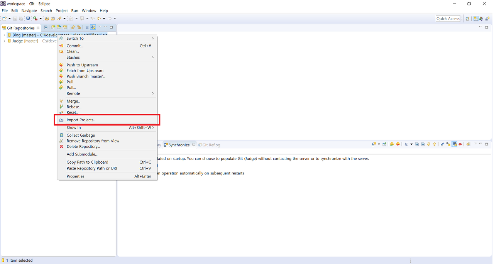
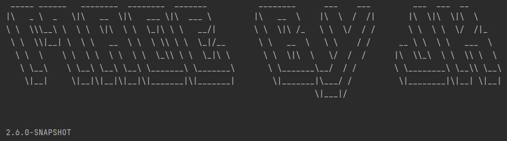
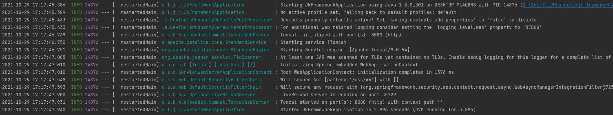

# jt-framework
## 프로젝트 설명
* 스프링 부트
## 프로젝트 환경
* Java 1.8.0_301
* apache-maven-3.8.2
* Spring Boot 2.6.0-SNAPSHOT
## 기타 프로젝트 환경
* jsp
* Intellij

## 프로젝트 구성
### 의존성
* spring-boot-starter-security
* spring-boot-devtools
* spring-security-taglibs
* spring-boot-starter-web
* mybatis-spring-boot-starter 2.2.0
* lombok
* spring-boot-starter-tomcat
* mariadb-java-client 2.7.3
* jstl
* tomcat-embed-jasper
* sitemesh 3.0.1
* log4jdbc-log4j2-jdbc4
* spring-boot-starter-log4j2
### 그외 구성
* spring boot interceptor

## 구성 제외
* spring-boot-starter-logging

## 대략적인 이클립스 셋팅( 전자정부 프레임워크 )
* 이클립스 실행
* https://github.com/snjune6/jt-framework.git 클론 후
* 아래사진과 같이 진행하면 프로젝트가 셋팅이 된다. 

* 이후 서버는 스프링 부트에 내장되어 있으므로 프로젝트 우클릭 후 run as에서 스프링 관련 서버실행하는 부분이 있음
* 다음 사진과 같이 로고와 로깅이 된다면 작업환경은 완료
* 이클립스는 Lombok셋팅을 해야하는데 이거는 11월 1일날 작성하겠습니다.
* https://rearea.tistory.com/81 <- Lombok셋팅과 Lombok가 이용되는 이유/설명

